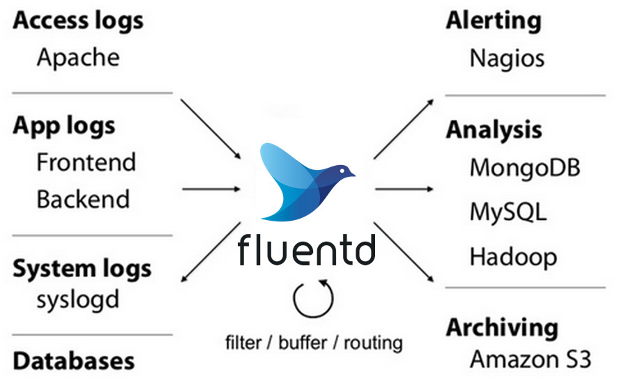
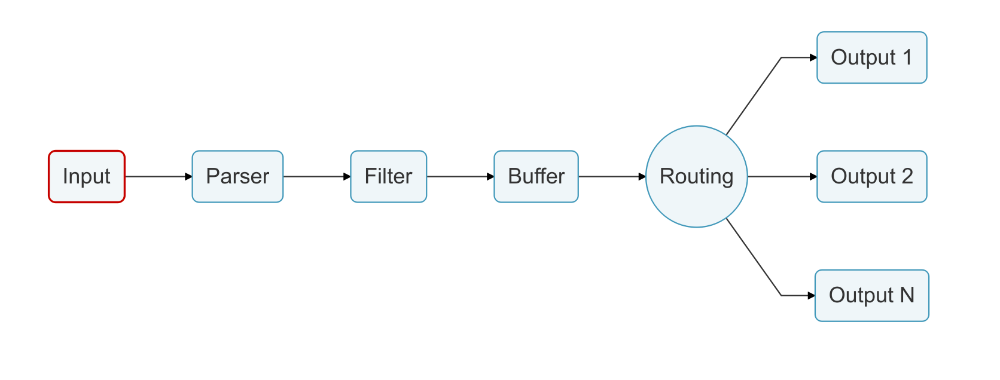

# 日志收集服务
## Fluentd 开源日志收集器
> Fluentd 是一个开源的数据收集器，它可以让您统一数据的收集和消费，以便更好地使用和理解数据


### 主要功能
- 使用JSON作为统一的日志收集记录
  - Fluentd 尝试尽可能将数据结构化为 JSON：使用Fluentd统一处理日志数据的所有方面：
  - 收集、过滤、缓冲和跨多个源和目的地输出日志（统一日志层）。
  - 使用 JSON 进行下游数据处理要容易得多，因为它有足够的结构可供访问，同时保留灵活的模式。
- 可插拔架构
  - 具备灵活的插件系统，目前社区拥有500多个插件连接数十个数据输入和数据输出
- 环境依赖
    - Fluentd 是用 C 语言和 Ruby 组合编写
    - 实例在 30-40MB 内存上运行，可以每秒处理 13,000 个事件
    - 如果有更严格的内存要求 (-450kb)，请查看Fluent Bit，Fluentd 的轻量级转发器
    
### 安装和运行
#### 安装ruby
##### 1.下载安装包
```shell
wget https://cache.ruby-china.com/pub/ruby/ruby-2.6.5.tar.xz
```
##### 2.解压安装
```shell
xz -d ruby-2.6.5.tar.xz         第一次解压，得到ruby-2.6.5.tar
tar -xvf ruby-2.6.5.tar         第二次解压，得到目录ruby-2.6.5
```
##### 3.安装
```shell
$ cd /home/joyce/soft/ruby-2.6.5     进入目录
$ ./configure                        执行配置。或者：   ./configure  --with-openssl-dir=/usr/local/ssl  可以解决报错：Unable to require openssl, install OpenSSL and rebuild ruby (preferred) or use non-HTTPS sources
$ make                               make一下，这步不能省    
$ sudo make install                  安装
$ ruby -v                            验证

[root@192 ruby-2.6.5]# ruby -v
ruby 2.6.5p114 (2019-10-01 revision 67812) [x86_64-linux]
```
#### 快速安装fluentd
```shell
$ gem install fluentd
$ fluentd -s conf
$ fluentd -c conf/fluent.conf &
$ echo '{"json":"message"}' | fluent-cat debug.test
```
## Fluent Bit 轻量日志处理器
> 一个快速，轻量日志处理器，流处理器和转发器的Linux，OSX，Windows和BSD系列操作系统。它非常注重性能，以允许从不同来源收集事件而不复杂
> Fluent Bit是适用于 Linux、Windows、嵌入式 Linux、MacOS 和 BSD 系列操作系统的快速日志处理器和转发器。它是Graduate Fluentd生态系统和CNCF子项目的一部分。
> Fluent Bit 允许从不同来源收集日志事件或指标，处理它们并将它们传送到不同的后端，例如Fluentd、Elasticsearch、Splunk、DataDog、Kafka、New Relic、Azure 服务、AWS 服务、Google 服务、NATS、InfluxDB 或任何自定义 HTTP 端点。
> Fluent Bit 具有完整的 SQL流处理功能：使用 SQL 查询进行数据操作和分析。
> Fluent Bit 在 x86_64、x86、arm32v7 和 arm64v8 架构上运行。

- Input 数据输入
- Parser 解析
- Filter 过滤
- Buffer 缓冲
- Routing 路由
- output 输出
### 安装运行
```shell
cd build
cmake ..
make
bin/fluent-bit -i cpu -o stdout -f 1
```
或者使用cmake
```shell
$ cd build/
$ cmake ../
-- The C compiler identification is GNU 4.9.2
-- Check for working C compiler: /usr/bin/cc
-- Check for working C compiler: /usr/bin/cc -- works
-- Detecting C compiler ABI info
-- Detecting C compiler ABI info - done
-- The CXX compiler identification is GNU 4.9.2
-- Check for working CXX compiler: /usr/bin/c++
-- Check for working CXX compiler: /usr/bin/c++ -- works
...
-- Could NOT find Doxygen (missing:  DOXYGEN_EXECUTABLE)
-- Looking for accept4
-- Looking for accept4 - not found
-- Configuring done
-- Generating done
-- Build files have been written to: /home/edsiper/coding/fluent-bit/build
```
完成后
```shell
$ make
Scanning dependencies of target msgpack
[  2%] Building C object lib/msgpack-1.1.0/CMakeFiles/msgpack.dir/src/unpack.c.o
[  4%] Building C object lib/msgpack-1.1.0/CMakeFiles/msgpack.dir/src/objectc.c.o
[  7%] Building C object lib/msgpack-1.1.0/CMakeFiles/msgpack.dir/src/version.c.o
...
[ 19%] Building C object lib/monkey/mk_core/CMakeFiles/mk_core.dir/mk_file.c.o
[ 21%] Building C object lib/monkey/mk_core/CMakeFiles/mk_core.dir/mk_rconf.c.o
[ 23%] Building C object lib/monkey/mk_core/CMakeFiles/mk_core.dir/mk_string.c.o
...
Scanning dependencies of target fluent-bit-static
[ 66%] Building C object src/CMakeFiles/fluent-bit-static.dir/flb_pack.c.o
[ 69%] Building C object src/CMakeFiles/fluent-bit-static.dir/flb_input.c.o
[ 71%] Building C object src/CMakeFiles/fluent-bit-static.dir/flb_output.c.o
...
Linking C executable ../bin/fluent-bit
[100%] Built target fluent-bit-bin
```
最后
```shell
$ make install
```
详细参考
https://docs.fluentbit.io/manual/installation/sources/build-and-install
### Fluent Bit 日志数据处理流程
